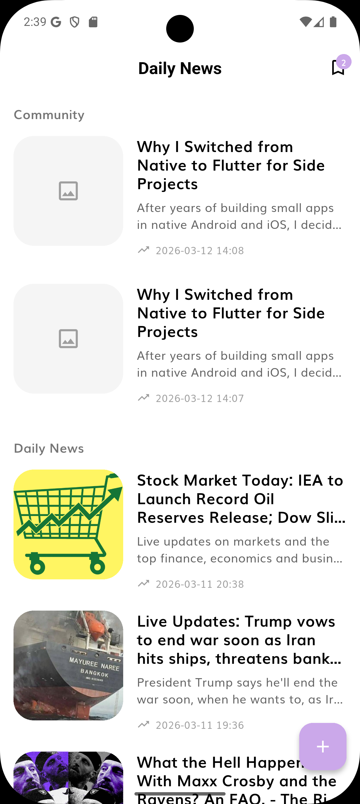
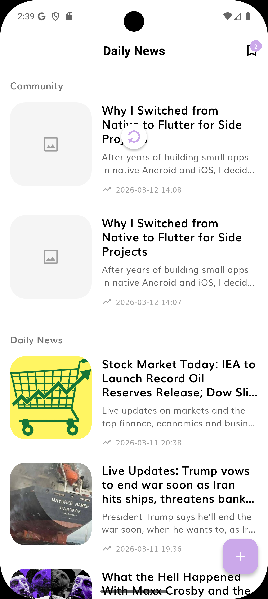
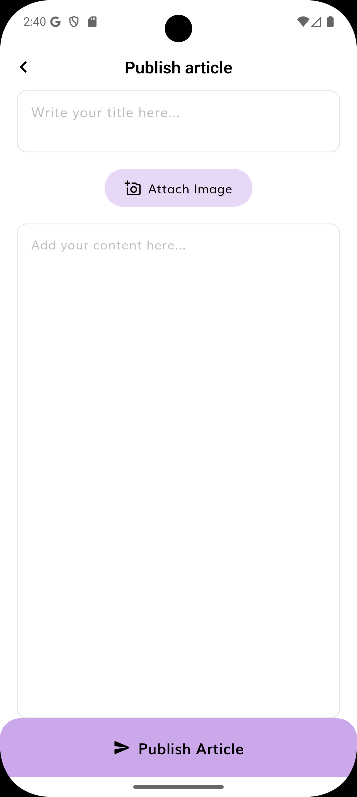
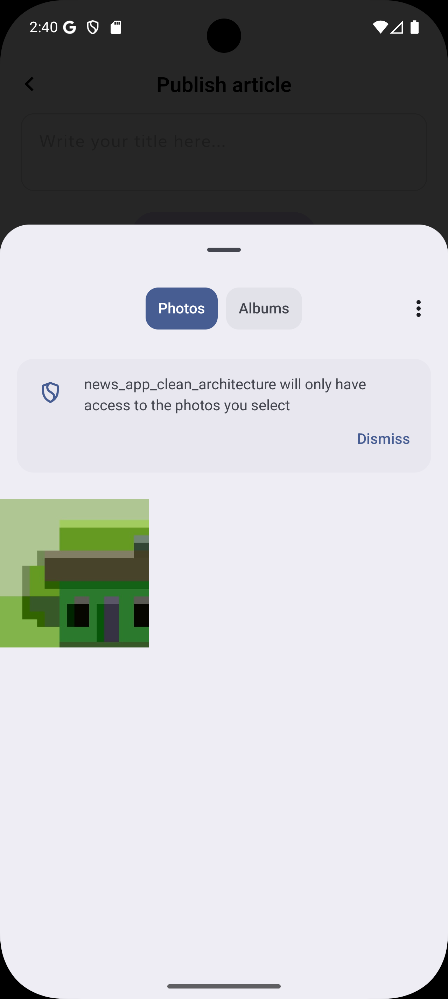
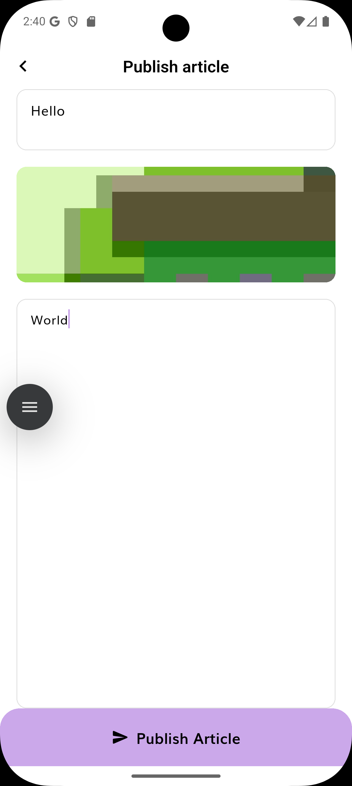
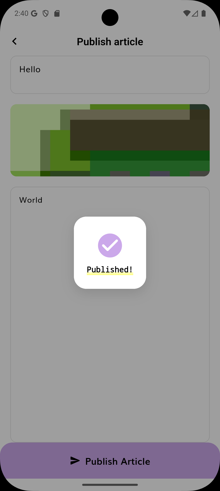
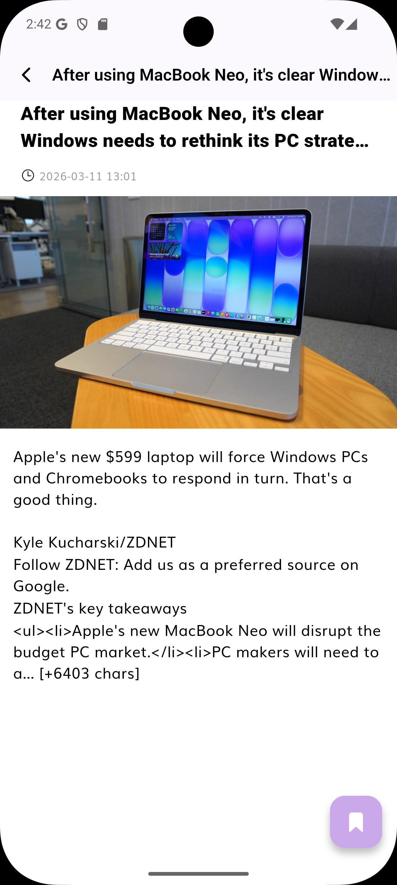
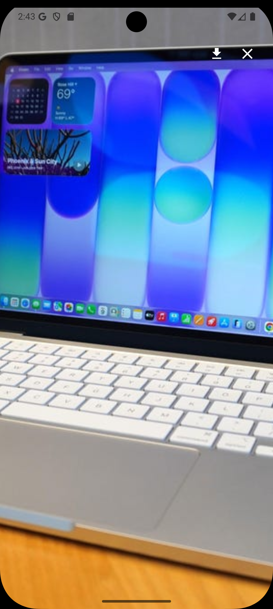
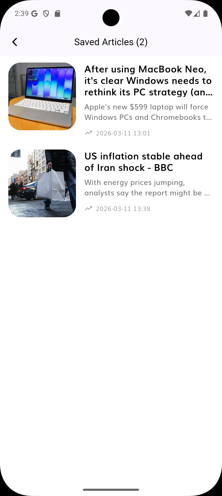
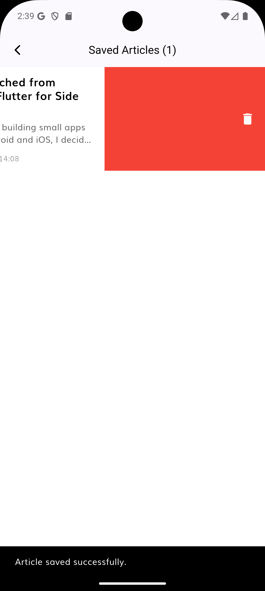

# Applicant Showcase App — Project Report

**Author:** Eduardo Gonzalez Gonzalez
**Date:** March 2026

---

## 1. Introduction

When I first read through the project requirements, my immediate reaction was a mix of excitement and honest respect for the scope. The challenge was clear: ramp up on Flutter, Firebase, and BLoC to a production-grade level and deliver a working app within 72 hours. That kind of constraint does not leave room for half-measures.

Before this assignment I had already built mobile UIs and applied clean architecture in other ecosystems, and I had prior exposure to Flutter and Dart. What this project pushed was taking that experience to a production‑level integration with Firebase, BLoC/Cubit, and the Android toolchain under a tight timebox. Rather than feeling intimidated, I treated this as a structured learning sprint with a concrete deliverable at the end — which is, frankly, the best way to learn anything.

---

## 2. Learning Journey and Technical Focus During the Assignment

### Flutter & Dart
For this assignment I deepened my experience with Flutter by revisiting the official documentation and selected codelabs, focusing on patterns that matter for a production app (navigation, theming, and state-driven UIs). Flutter's widget composition model — everything is a widget, and the tree structure maps cleanly to how I already think about UI. Dart felt immediately approachable given prior experience with typed languages; the null safety system in particular is well-designed.

### BLoC / Cubit
The BLoC pattern took the most deliberate study. The distinction between `Bloc` (event-driven) and `Cubit` (method-driven) is subtle but important. For the article upload feature, I chose `Cubit` because the state transitions are simple and linear — `Initial → Loading → Success/Error` — and the event layer would have added unnecessary ceremony. For the existing remote articles feature, the `Bloc` pattern was already in place and I preserved it.

### Firebase
Firebase setup involved three components: Firestore (document storage), Cloud Storage (media files), and Authentication (anonymous auth for ownership enforcement).  
I used the Firebase CLI and `flutterfire configure` to:
- Register an Android app with package `com.symmetry.newsapp.eg` in the `symmetry-news-eg` project.
- Generate and keep in sync `google-services.json` and `lib/firebase_options.dart`.
The more nuanced part was designing security rules that enforce schema validation at the database level — not just client-side.

### Clean Architecture
The existing codebase provided a reference implementation for the news feed feature. I studied it carefully before writing a single line for the upload feature, ensuring the new code followed the same layer boundaries: domain has no external dependencies, data handles Firebase directly, presentation only interacts with use cases through cubits.

---

## 3. Challenges Faced

### Dependency Compatibility
The most time-consuming challenge was not conceptual but environmental. The project's original dependency versions (`win32 5.3.0`, `path_provider_android 2.2.2`, `sqflite 2.3.2`, Kotlin `1.6.10`, AGP `8.3.0`) were incompatible with the newer Flutter SDK and Android build toolchain. Each build attempt surfaced a different incompatibility. The solution was a combination of `dependency_overrides` in `pubspec.yaml`, upgrading `settings.gradle`, and running `flutter pub upgrade` to resolve the full dependency graph.

**Lesson learned:** Always verify the compatibility matrix between Flutter SDK version, Kotlin version, AGP version, and Gradle version before writing a line of feature code on a legacy project.

### Firestore Security Rules
Writing Firestore rules that enforce schema validation — not just read/write permissions — required careful study of the rules DSL. The `isValidArticle()` function I wrote validates field types and required fields at the server level, which means the database rejects malformed documents even if someone bypasses the app.

### State Management After Navigation
After publishing an article, the home screen did not automatically refresh the Firebase feed because the `FirebaseArticlesCubit` had already completed its initial load. The fix was chaining a `.then()` on the navigation call to trigger `getArticles()` on return, and adding a `RefreshIndicator` that reloads both the News API feed and the Firebase feed simultaneously.

### Android Package Renaming
To align the app with a production‑ready identifier and branding, I renamed the Android package from
`com.example.news_app_clean_architecture` to `com.symmetry.newsapp.eg`, updated the Gradle
`namespace`/`applicationId`, moved the `MainActivity` Kotlin package, and re‑registered the
Android app in Firebase so all configuration files stayed consistent. I also updated the
user‑visible application name from the placeholder `news_app_clean_architecture` to
`Symmetry News Showcase` in the Android manifest, so the installed app reflects the purpose
of the assignment instead of the original template name.

---

## 4. Reflection and Future Directions

### What I Learned
- Flutter's declarative UI model rewards thinking in state, not in mutations. Once I internalized that, writing BLoC-connected widgets became natural.
- Firebase security rules are a first-class feature of the architecture, not an afterthought. They belong in the design phase alongside the schema.
- Clean architecture in Flutter is genuinely enforceable through import discipline. The boundary between domain and data is only as strong as the developer's commitment to it.

### Future Improvements
1. **Real authentication** — Replace anonymous auth with Google Sign-In or email/password. This would allow user profiles, article ownership UI, and the ability to edit or delete one's own articles.
2. **Offline support** — Cache Firebase articles locally using Floor (already in the project) so the Community Articles section loads from disk when there's no network.
3. **Pagination** — The current query fetches the last 20 articles. A `startAfterDocument` cursor would support infinite scroll.
4. **Article detail view for community posts** — Currently the detail screen is designed for News API articles. Community articles should have a dedicated layout that shows the full content body.
5. **Image compression** — Before uploading to Firebase Storage, compress the image client-side to reduce storage costs and improve load times.

---

## 5. Proof of the Project

Below are the main user flows and UI states demonstrated by the screenshots in `docs/assets/`.

### Home — Community + Daily News



- **What it shows:** The `DailyNews` home screen wired with both feeds.
  - Community section at the top driven by `FirebaseArticlesCubit`.
  - Daily News section below using the remote API.
  - Saved articles badge in the app bar supplied by `LocalArticleBloc`.



- **What it shows:** Pull-to-refresh in action.
  - The circular loading indicator overlays the first community card.
  - Both feeds are being refreshed in parallel (`RemoteArticlesBloc` + `FirebaseArticlesCubit`).

### Publish Article flow



- **What it shows:** Initial publish screen.
  - Empty title and content fields.
  - “Attach Image” pill button wired to the gallery picker.
  - Bottom “Publish Article” button ready but with no data yet provided.



- **What it shows:** System photo picker.
  - The app requests scoped access only to selected photos.
  - User is about to pick a thumbnail that will be uploaded to Firebase Storage.



- **What it shows:** Publish screen after selecting an image and typing content.
  - Title and body fields populated.
  - Selected image rendered inline with the Figma‑based card styling.



- **What it shows:** Success overlay.
  - After tapping “Publish Article”, a modal overlay confirms the article was published.
  - This corresponds to the `ArticleUploadCubit` success state.

### Article detail and media experience



- **What it shows:** Article detail with save experience.
  - Updated app bar with left‑aligned truncated title.
  - Hero image, metadata and full article text.
  - Floating bookmark button wired through `LocalArticleBloc`.


- **What it shows:** Full‑screen lightbox.
  - Dark backdrop, close icon and download action using `url_launcher`.
  - Image occupies the full screen and is ready for zoom/pan gestures.



- **What it shows:** Lightbox after pinch‑to‑zoom.
  - Confirms that the image can be zoomed and panned while controls remain available.

### Saved Articles UX



- **What it shows:** Saved articles list.
  - `SavedArticles` screen populated via `LocalArticleBloc`.
  - App bar shows the count `(2)` reflecting the current number of saved items.



- **What it shows:** Swipe‑to‑delete interaction.
  - One article tile slid left reveals a red delete background.
  - Snackbar at the bottom confirms an article has been saved successfully during the flow.

---

## 6. Overdelivery

### Project Structure Alignment
The codebase has been reorganized to match the architecture described in `docs/APP_ARCHITECTURE.md`:
- **Presentation:** screens live under `presentation/screens/` (not `pages/`), with subfolders `home`, `article_detail`, `saved_article`, and `publish_article`.
- **Domain:** use cases live under `domain/use_cases/` (not `usecases/`). All imports have been updated accordingly in `config/routes`, `main.dart`, `injection_container.dart`, and all blocs/cubits.

### New Features Implemented

#### Community Articles Feed
Beyond simply storing uploaded articles in Firestore, I implemented a full read-back cycle: the home screen now displays a **"Community Articles"** horizontal card carousel at the top of the feed, sourced from Firestore and kept in sync with real-time updates. This closes the loop — users can publish an article and immediately see it appear in the app without having to restart it.

**Implementation:** `FirebaseArticleDataSource.watchArticles()` (Firestore `snapshots()`) → `ArticleUploadRepository.watchArticles()` → `FirebaseArticlesCubit` subscription → `DailyNews` home screen with `BlocBuilder<FirebaseArticlesCubit>`.

#### Pull-to-Refresh
The home screen supports pull-to-refresh via `RefreshIndicator`, which simultaneously reloads both the News API feed and the Firebase community feed in parallel.

#### Saved Articles UX
The saved articles experience was upgraded in three ways:
- The saved screen (`SavedArticles`) shows a badge with the current count in the app bar (`Saved Articles (N)`).
- Each saved tile supports iOS-style swipe-to-delete using `Dismissible`, with a red background and delete icon.
- The home app bar shows a bookmark icon with a small badge that reflects the number of saved articles, wired through `LocalArticleBloc`.

#### Detail & Media Experience
- The article detail app bar was updated so long titles are left-aligned and nicely truncated, avoiding awkward centering issues.
- The image lightbox (`ImageLightbox`) now supports:
  - Pinch-to-zoom and pan via `InteractiveViewer` on the full screen area.
  - Tap anywhere or vertical swipe to dismiss.
  - A “download” action that opens the image URL in the system browser using `url_launcher`, with graceful error handling.

#### List Animations and Layout Consistency
- All article tiles (`ArticleWidget`) animate in smoothly using a scale + opacity `TweenAnimationBuilder`, making scroll interactions feel more dynamic without being distracting.
- The Community section layout was adjusted to use a vertical list powered by the same `ArticleWidget` and `ArticleTileSkeleton` used in the Daily News section so both feeds feel consistent.

#### Firestore Schema Validation via Security Rules
The `firestore.rules` file includes a `isValidArticle()` function that enforces field types, required fields, and value constraints (e.g., title length ≤ 200 chars) at the database level — not just in the app. This means the data contract is enforced even if a malicious client bypasses the Flutter app entirely.

#### Anonymous Authentication for Ownership
Rather than leaving articles authorless or skipping the `authorId` requirement, I implemented Firebase Anonymous Auth as a zero-friction ownership layer. This satisfies the security rules while keeping the UX frictionless. The architecture is ready to upgrade to a persistent account via `linkWithCredential()`. The current UI does not expose an explicit login flow; authentication happens transparently inside the Firebase data source.

### Prototypes Created

#### Firebase Architecture Diagram

```
Flutter App
    │
    ├── Presentation Layer
    │       └── ArticleUploadCubit ──► UploadArticleUseCase
    │       └── FirebaseArticlesCubit ──► GetFirebaseArticlesUseCase
    │
    ├── Domain Layer (pure Dart)
    │       └── ArticleUploadRepository (abstract)
    │       └── Entities, UseCases
    │
    └── Data Layer
            └── FirebaseArticleDataSourceImpl
                    ├── FirebaseAuth  (anonymous sign-in)
                    ├── FirebaseStorage  (media/articles/)
                    └── FirebaseFirestore  (articles collection)
```

### How Can This Be Improved Further

- **Push notifications** — When a new community article is published, notify other users via Firebase Cloud Messaging.
- **Content moderation** — Integrate a Cloud Function trigger on `articles` document creation to scan content with the Natural Language API before making it publicly visible.

---

## 7. Extra Sections

### Dependency Compatibility Resolution

A significant portion of setup time was spent resolving incompatibilities between the project's original dependency versions and the current Flutter/Android toolchain. The final working versions are:

| Component              | Original    | Final      |
|------------------------|-------------|------------|
| Kotlin                 | 1.6.10      | 2.1.0      |
| Android Gradle Plugin  | 8.3.0       | 8.9.1      |
| Gradle Wrapper         | 8.4         | 8.11.1     |
| Dart SDK constraint    | `<3.0.0`    | `>=3.0.0`  |
| `win32`                | 5.3.0       | 6.0.0      |
| `path_provider_android`| 2.2.2       | 2.2.12+    |

These changes are fully documented in the project's `pubspec.yaml` under `dependency_overrides` and in the Android Gradle files.

---

## 8. Assignment Coverage Checklist

This section explicitly maps the original assignment requirements to the work completed in this repository.

### 1. Backend — Firestore & Storage

- **1.1 Schema design**  
  - The Firestore schema for `articles` and the Cloud Storage layout for `media/articles/` are documented in  
    `backend/docs/DB_SCHEMA.md`.

- **1.2 Schema implementation**  
  - Firestore uses a top‑level `articles` collection with the fields described in the schema.
  - Cloud Storage stores thumbnails under `media/articles/{timestamp_filename}`.

- **1.3 Schema enforcement with security rules**  
  - `backend/firestore.rules` contains the `isValidArticle(data)` function that validates:
    - Required fields: `title`, `authorId`, `publishedAt`.
    - Types and simple invariants (e.g. title length ≤ 200).
  - Only authenticated users can create, update or delete, and updates/deletes are restricted to the original `authorId`.
  - `backend/storage.rules` enforces:
    - Authenticated writes only.
    - Max upload size (5 MB) and MIME type `image/*` for `media/articles/{imageId}`.

### 2. Frontend — Business, Presentation, Data

- **2.1 Business layer (use cases with clean architecture)**  
  - New domain use cases:
    - `UploadArticleUseCase` — uploads community articles.
    - `GetFirebaseArticlesUseCase` — reads community articles from Firestore.
    - `GetSavedArticleUseCase`, `SaveArticleUseCase`, `RemoveArticleUseCase` — manage local saved articles.
  - All use cases live under `features/daily_news/domain/use_cases/` and implement the generic `UseCase<T, P>` interface in `core/usecase/usecase.dart`.
  - Use cases only depend on abstract repositories in `domain/repository/`, not on Flutter or Firebase.

- **2.2 Presentation layer (screens + BLoC/Cubit + Figma UI)**  
  - Screens under `presentation/screens/`:
    - `home/DailyNews` — orchestrates the News API feed and the Community section, plus navigation to details, saved articles and publish.
    - `publish_article/PublishArticlePage` — implements the Figma publish screen with title/content fields, image picker and bottom publish button.
    - `article_detail/ArticleDetailsView` — detail screen with skeleton state, image lightbox and save FAB.
    - `saved_article/SavedArticles` — list (or empty state) of saved articles.
  - State management:
    - `RemoteArticlesBloc` — existing remote news feed.
    - `FirebaseArticlesCubit` — community articles from Firestore, with cache + pull‑to‑refresh.
    - `ArticleUploadCubit` — upload flow (`Initial → Loading → Success/Error`).
    - `LocalArticleBloc` — saved articles (list, save, remove).
  - The home screen wires these blocs/cubits using `BlocProvider`/`MultiBlocProvider`, and the UI closely follows the provided Figma prototype.

- **2.3 Data layer (real Firebase integration instead of mocks)**  
  - `FirebaseArticleDataSourceImpl` in `data/data_sources/remote`:
    - Uploads optional images to `media/articles/` in Firebase Storage.
    - Writes Firestore documents into `articles` with owner `authorId`, and optional metadata (`author`, `description`, `content`, `url`, `urlToImage`).
    - Reads and maps Firestore documents into `ArticleEntity` objects ordered by `publishedAt DESC`.
    - Uses anonymous authentication (`FirebaseAuth.signInAnonymously()`) to satisfy security rules.
    - Writes a cached copy via `FirebaseArticlesCache` for better perceived performance.
  - `ArticleUploadRepositoryImpl` and `ArticleRepositoryImpl` connect the domain layer to Firestore/Storage and to the existing REST API.

### 3. Tests

- **Bloc/Cubit tests**
  - `ArticleUploadCubit` tests:
    - Success path: emits `[Loading, Success]` when the use case returns `DataSuccess`.
    - Repository error: emits `[Loading, Error]` when the use case returns `DataFailed`.
    - Exception path: emits `[Loading, Error]` when the use case throws.
    - Verifies that the optional `File` is forwarded correctly to the use case.
  - `FirebaseArticlesCubit` tests:
    - Initial state is `FirebaseArticlesLoading`.
    - Uses cache first when available (`showLoading=false`).
    - Emits `FirebaseArticlesError` when there is no cache and the use case fails.
    - With `showLoading=true`, starts in `Loading` and ends in `Done` on success.
  - `LocalArticleBloc` test:
    - When `GetSavedArticles` is dispatched, emits `LocalArticlesDone` with the articles returned by `GetSavedArticleUseCase`.

- **Data layer tests**
  - `FirebaseArticleDataSourceImpl` tests:
    - `uploadArticle` completes successfully when no user is signed in, performing an anonymous sign‑in and writing to the `articles` collection.
    - `getArticles` reads from Firestore, maps to `ArticleEntity` and writes the result into the cache.

- **Use case tests**
  - `GetFirebaseArticlesUseCase` test:
    - Verifies that the use case delegates to `ArticleUploadRepository.getArticles()` and returns its result unchanged.

Together, these tests exercise the critical paths of the new feature (upload, read community feed, saved articles) and validate that the clean‑architecture boundaries (use cases, repositories, data sources) are wired correctly.
